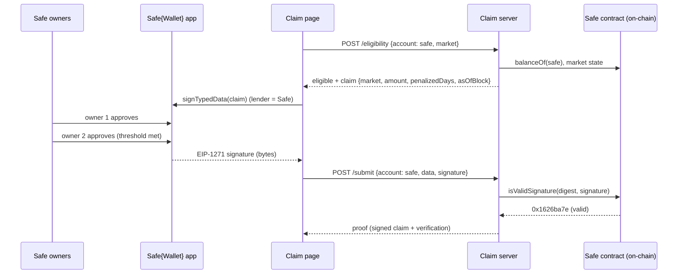

# Safe (multisig) support

## Short answer

A **Safe is a smart contract, not a keypair** — it has no private key and cannot produce an
ECDSA signature. The original flow recovered the signer with `ecrecover` (ethers
`verifyTypedData` / `verifyMessage`), which **does not work for a Safe**.

Safe support requires **EIP-1271**: instead of recovering a key, you ask the wallet contract
`isValidSignature(hash, signature)` and check for the magic return value `0x1626ba7e`. The tool
now does exactly this — it verifies a signature is valid **for the claimed lender address**:
ECDSA for EOAs, EIP-1271 for contract wallets (Safe). Eligibility (`balanceOf(lender)`) was
already address-agnostic, so once the signature check handles contracts, a Safe works end to end.

This is **proven** by `wildcat-claims/scripts/prove-safe-eip1271.js` (output below).

## Step by step (how a Safe lender uses it)

1. **Connect the Safe.** The lender opens the claim page through the Safe{Wallet} app
   (WalletConnect, or the Safe dapp browser). The connected account is the **Safe address**.
2. **Check eligibility.** `POST /eligibility { account: <safe>, market }` reads the Safe's
   on-chain position (`balanceOf(safe)` + withdrawals). No change was needed here — it works for
   any address.
3. **Sign the claim.** The lender signs the EIP-712 claim. The Safe app routes this to the
   owners; each required owner approves. Once the **threshold** is met, the Safe yields an
   EIP-1271 signature. This is asynchronous — owners may approve at different times, so the
   request resolves when enough have signed (high-threshold Safes may use on-chain `approveHash`).
4. **Submit.** The frontend posts `{ account: <safe>, data, signature }`.
5. **Verify.** The server computes the EIP-712 digest and calls
   `safe.isValidSignature(digest, signature)`. `0x1626ba7e` ⇒ the Safe's owners authorized it.
   The server re-checks the Safe's eligibility live and returns the copyable proof.

## Flow



## Why EIP-1271 instead of `ecrecover`

| | EOA (e.g. MetaMask) | Safe multisig |
|---|---|---|
| Has a private key | yes | **no** |
| "Signature" is | one ECDSA sig | owner approvals aggregated by the Safe |
| Verify by | `ecrecover(hash, sig) == address` | `safe.isValidSignature(hash, sig) == 0x1626ba7e` |

The server picks the path automatically: if the lender address has contract code it uses
EIP-1271, otherwise ECDSA. (`src/wildcat/chain.ts: isContract` / `isValidErc1271`;
`src/app.ts` `/submit`.)

## Proof (local chain + mock Safe)

`scripts/prove-safe-eip1271.js` deploys a faithful mock Safe (2-of-3 — same `isValidSignature`
interface and ascending-owner threshold check a real Safe uses), has two owners sign the **real**
claim digest, and runs it through the tool's actual verification code:

```
Mock Safe (2-of-3) deployed at 0x6D3E8aCeD2674f2C0403a7F2a34b2F6d390e1903
Claim digest (EIP-712)         0xb954933898508b16301d22be1cac9ddf1a08b5f946839425b4f49c7c024b6515

— Raw EIP-1271 (what any verifier sees) —
  isValidSignature(digest, 2 owner sigs) = 0x1626ba7e (0x1626ba7e = valid)
  isValidSignature(digest, 1 owner sig)  = reverted: not enough signatures (below threshold → rejected)

— Through the tool’s actual verification code —
  chain.isContract(safe)                 = true
  chain.isValidErc1271(safe, 2 sigs)     = true   ← /submit accepts the Safe
  chain.isValidErc1271(safe, 1 sig)      = false   ← rejected (threshold not met)
  chain.isValidErc1271(safe, garbage)    = false
```

Run it: `cd wildcat-claims && npm i -D ganache solc && npm run build && node scripts/prove-safe-eip1271.js`

> A mainnet fork with a real, deployed Safe would behave identically — a real Safe returns the
> same `0x1626ba7e` for a valid owner-threshold signature. We used a local chain because this
> environment can't reach an archive RPC to fork. The mock simplifies only the *inner* hashing
> (a real Safe wraps the digest in a domain-separated `SafeMessage` via its
> CompatibilityFallbackHandler); the EIP-1271 **interface and threshold semantics** the tool
> integrates against are identical.

## Notes & caveats

- **Deployed Safes only.** EIP-1271 is a call to the wallet contract, so the Safe must be
  deployed. Wildcat lenders' Safes are deployed (they hold the market tokens), so this is fine.
  A counterfactual/undeployed smart account would need ERC-6492 — out of scope.
- **Fallback handler.** Off-chain Safe message validation uses the Safe's
  CompatibilityFallbackHandler (the default on modern Safes).
- **Frontend.** The page is a Safe **Custom App**: it serves `/manifest.json` + `/icon.svg`, and
  on load `trySafeApp()` detects the Safe{Wallet} iframe (via `@safe-global/safe-apps-sdk`),
  auto-connects to the Safe address, and routes signing through `SafeAppProvider` — which yields
  the EIP-1271 signature the server verifies. Most Safe lenders will open the tool this way (Apps →
  add Custom App → this URL). Outside the Safe iframe the page falls back to a normal injected
  wallet (MetaMask, etc.). Standalone **WalletConnect-to-Safe** (connecting a Safe from the
  non-iframe site) is the one remaining UX gap and is a future addition.
